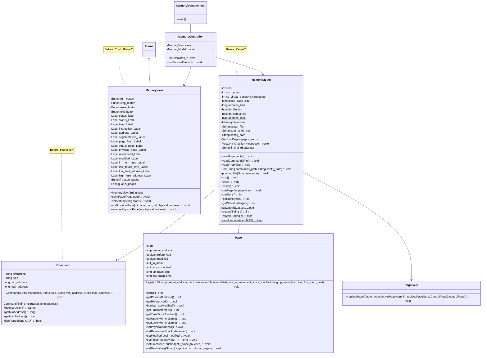

# Coolest MOSS

> Working on Java JDK 8+

## Compilation

```bash
javac -nowarn *.java
```

## Run

```bash
java MemoryManagement.java commands memory.conf
```

## Experimental - MVC Migration Class Diagram

